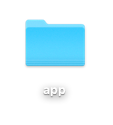
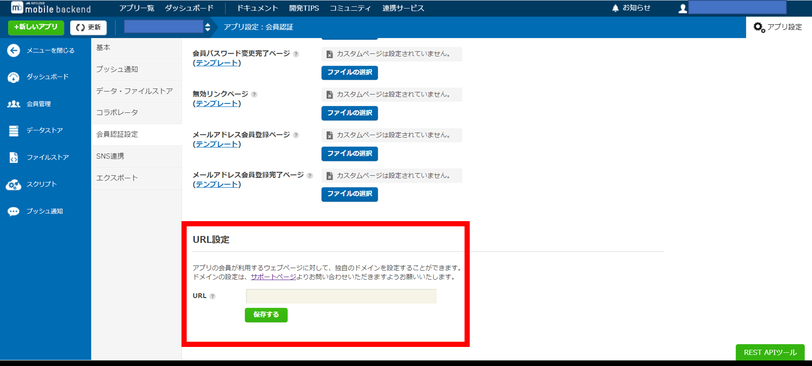
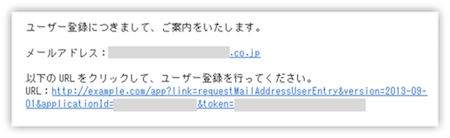
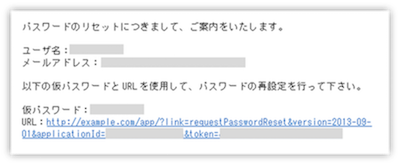
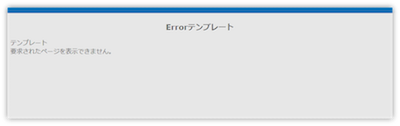
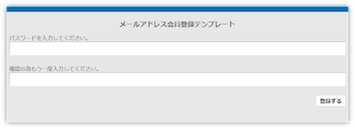
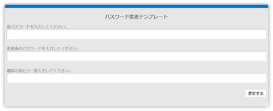
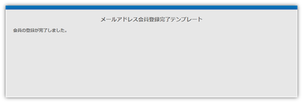

# カスタムURLの設定

__目次__
1. 概要・免責
1. ページファイルの用意
1. 独自ドメインの設定
1. サーバでのリクエスト識別処理の設定
1. ブラウザでの動作確認
1. ニフクラ mobile backend からの動作確認
1. 登録結果ページの設定

<font size="1"><div style="position: absolute; left: 55mm; bottom: 5mm;">_Copyright © FUJITSU CLOUD TECHNOLOGIES LIMITED All Rights Reserved._</div></font>

<div style="page-break-before:always"></div>

## 1. 概要・免責
パスワード変更画面や、無効リンクページ、メールアドレス確認画面等、アプリの会員がアクセスするウェブページに対して、独
自のドメインを設定することができます。
この文書では、既にニフクラ mobile backend をご利用中のお客様が、上記のような会員がアクセスするページに独自ドメインを適用する手順を順に説明しています。
なお、この文書のバージョンは 2.0 となります。
また、付属のテンプレートファイルのライセンスにつきましては、LICENSE.txt をご覧ください。

__※独自ドメインを割り当てるサーバはお客様ご自身でご用意いただく必要がございます。予めご了承ください。__

<div style="page-break-before:always"></div>

## 2. ページファイルの用意
会員登録画面やパスワード変更画面に相当するページのファイルを独自ドメインのサーバー側に用意します。

* 同封のappフォルダー内に、デフォルトテンプレートファイルをご用意しています
 * 実装の一例として、Apache等の一般的なWebサーバをご利用でPHPが動作する環境であれば、付属テンプレート内の「`index.php`」ファイルをご利用頂けます。
 * 同様の処理が行われれば正常に動作しますので、お客様の環境や状況に沿った手法でご利用ください。
* テンプレートをご利用の場合は、appフォルダごとサーバーにアップロードして下さい
 * 動作確認後、必要に応じて本テンプレートを編集してご利用下さい

<div align="center"></div>

<div style="page-break-before:always"></div>

## 3. 独自ドメインの設定
設定したい独自ドメインを、お持ちのサーバーに割り当てます。
その後、ニフクラ mobile backendの[コントロールパネル]>[アプリ設定]>[会員認証設定ページ]の「URL設定」欄に、ニフクラ mobile backend に代わってユーザのアクセスを受け付けるURL（独自ドメイン）を入力します。

<font size="2">例）<br>独自ドメインが「`http://example.com/`」で、同封のテンプレート（appフォルダ）を使用する場合は、「`http://example.com/app/`」と入力します</font>

<div align="center"></div>

* メールアドレス登録要求、パスワード変更要求の際に送信されるメールにこのURLが表示されます。

<div style="page-break-before:always"></div>

## 4. サーバでのリクエスト識別処理の設定
ユーザはメールに表示されるリンクをクリックすることでお客様のサーバへアクセスが可能です。
メールに記載されるURLは以下のような形式です。
なお、API バージョンは”2013-09-01”です。

```
{設定済カスタム URL}?link={mBaasAPI 名}
                  &version={API バージョン}
                  &applicationId={アプリケーション ID}
                  &token={ワンタイムトークン}
```

### サンプル

* requestMailAddressUserEntry: メールアドレス登録
<center></center>

* requestPasswordReset: パスワード再発行登録
<center></center>

<div style="page-break-before:always"></div>

ユーザリクエストのlinkパラメータより処理を識別し、それぞれリダイレクト処理を設定します。パラメータの種類とそれぞれのリダイレクト先は次の通りとなります。リダイレクト時のHTTPステータスコードには「303」をご指定ください。

#### requestMailAddressUserEntry: メールアドレス登録
「`link=requestMailAddressUserEntry`」の場合は、お客様サーバー内の「`/app/mailAddressUserEntry/index.html`」にリダイレクトされます

#### requestPasswordReset: パスワード再発行登録
「`link=requestPasswordReset`」の場合は、お客様サーバー内の「`/app/passwordModify/index.html`」にリダイレクトされます

#### mailAddressConfirm: メールアドレス確認

以下のURLへtokenパラメータを付与してリダイレクトし、GETリクエストを送信します。
```url
https://mbaas.api.nifcloud.com
       /{API バージョン}
       /applications/{アプリケーション ID}
       /mailAddressConfirm?token={ワンタイムトークン}
```

<div style="page-break-before:always"></div>

## 5. ブラウザでの動作確認
以下の方法で動作確認をしてください。

* 設定したカスタムURLへそのまま（パラメータを付与せずに）アクセスして下さい
 * 下記のように、Errorテンプレートページへリダイレクトされれば正常に動作しております。

<div align="center"></div>

#### requestMailAddressUserEntry: メールアドレス登録
* 以下のようにパラメータを付与してアクセスして下さい
 * メールアドレス登録画面へリダイレクトされれば正常に動作しております。

```
link=requestMailAddressUserEntry
    &version={API バージョン}
    &applicationId={アプリケーション ID}
    &token={ワンタイムトークン}
```

<div align="center"></div>

<div style="page-break-before:always"></div>

#### requestPasswordReset: パスワード再発行登録
* 以下のようにパラメータを付与してアクセスして下さい
 * パスワード変更画面へリダイレクトされれば正常に動作しております。

```
link=requestPasswordReset
    &version={API バージョン}
    &applicationId={アプリケーション ID}
    &token={ワンタイムトークン}
```

<div align="center"></div>

<div style="page-break-before:always"></div>

## 6. ニフクラ mobile backend からの動作確認
ニフクラ mobile backend を利用しているアプリケーションからメールアドレス登録要求、パスワード変更要求の処理を行い、実際にメールを送信して動作確認をします。
受信したメールアドレスに記載されているURLが、お客様が設定した独自ドメインのURLであるかご確認ください。
該当URLよりメールアドレス登録、パスワード変更を行うことができれば正常に動作しております。

<div align="center"></div>

<div style="page-break-before:always"></div>

## 7. 登録結果ページの設定
お客様のサーバで登録が成功した後に遷移するページを用意します。（テンプレートをご利用の場合すでに用意されています。必要に応じて編集してご利用下さい。）

ニフクラ mobile backend での処理の後、それぞれ以下のURLにリダイレクトされます。

* メールアドレス会員登録完了
```
{設定済カスタム URL}/mailAddressUserEntryComplete/
```
* パスワード変更完了
```
{設定済カスタム URL}/passwordModifyComplete/
```
* メールアドレス確認完了
```
{設定済カスタム URL}/emailConformComplete/
```
* エラーページ
```
{設定済カスタム URL}/invalidLink/
```

テンプレートファイルでは各ディレクトリに index.html を配置しておりますので、必要に応じて編集してご利用ください。

__※テンプレート内でのinvalidLinkについては、ページ表示時のエラー(不正URL、不正パラメータ)と登録時のエラー
(不正ワンタイムトークン)で同じページを参照しています。__
